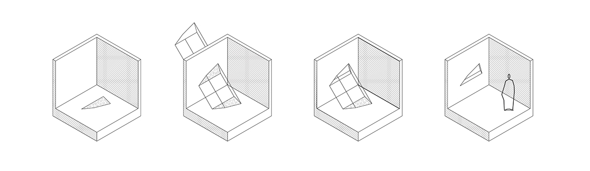
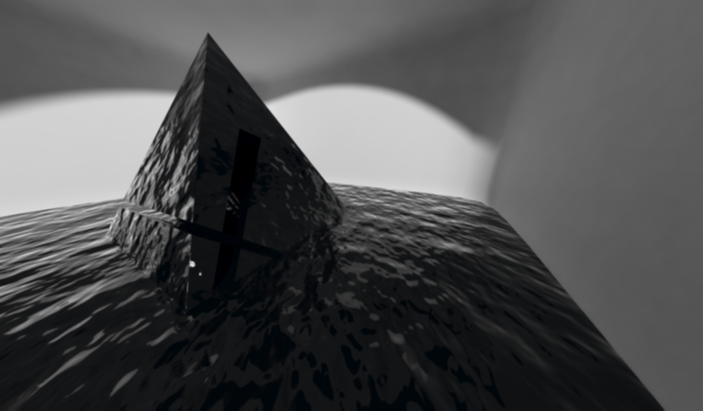
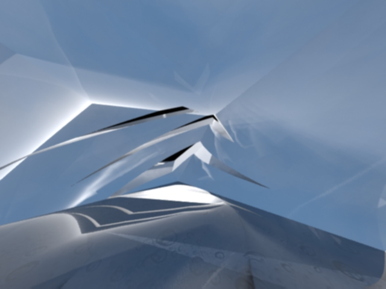
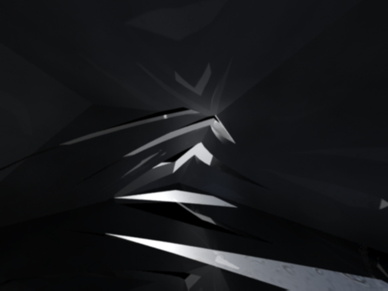

# Light Cutter - MaxScript 

## Info 

 The script creates a cut out in a given mass that is aligned with the  position of the sun, as well as cutting out walls around the opening to  create a space. The cut out can be any 2D shape - consequently, the  script allows for the generation of openings that range in shape from  simple to very complex. 

The original 3D shape and the 2D shape are  chosen manually, and the altitude and azimuth of the sun can be defined  using the control panel of the script.

## Working Examples

